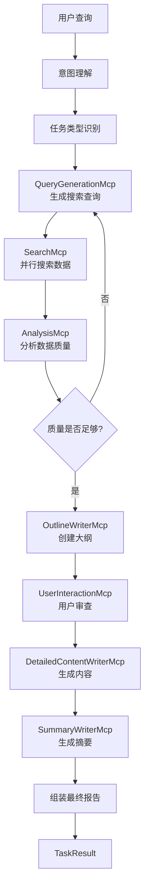

# MasterMcp统一管理系统使用指南

## 🎯 概述

**MasterMcp** 是一个统一的主控MCP系统，它将所有7个MCP组件整合在一起，提供单一入口点来处理各种任务。你不再需要手动选择使用哪个agent或MCP组件，MasterMcp会自动识别用户意图并调用相应的子组件。

## 🚀 快速开始

### 基本使用

```python
from collectors.master_mcp import MasterMcp

# 初始化MasterMcp
master_mcp = MasterMcp()

# 直接使用自然语言查询，自动识别任务类型
result = master_mcp.execute_task("分析ChatGPT在教育行业的影响和商业机会")

print(f"任务类型: {result.task_type.value}")
print(f"质量评分: {result.quality_score}")
print(f"输出文件: {result.output_path}")
```

### 原来的Insight生成 → 现在的使用方式

**🔴 原来的方式:**
```python
# 需要导入特定的生成器
from generate_insights_report_updated import generate_insights_report

# 手动指定参数和配置
result = generate_insights_report(
    topic="AI发展趋势",
    days_back=30,
    max_results=20
)
```

**🟢 现在的方式:**
```python
# 统一入口，自动识别为洞察生成任务
from collectors.master_mcp import MasterMcp

master_mcp = MasterMcp()

# 自动识别意图，自动配置参数，自动执行完整流程
result = master_mcp.execute_task("分析AI发展趋势的洞察和商业机会")
```

## 📋 支持的任务类型

MasterMcp自动识别以下任务类型：

| 任务类型 | 描述 | 示例查询 |
|---------|------|---------|
| **insight_generation** | 洞察生成 | "分析人工智能发展的商业机会" |
| **research_report** | 研究报告 | "写一份量子计算技术研究报告" |
| **news_analysis** | 新闻分析 | "分析特斯拉最新财报的市场影响" |
| **market_research** | 市场研究 | "电动汽车充电桩市场竞争分析" |
| **academic_report** | 学术报告 | "深度学习在医疗影像中的应用研究" |
| **business_analysis** | 商业分析 | "Netflix的流媒体战略分析" |
| **technical_doc** | 技术文档 | "React 18新特性技术说明" |
| **summarization** | 内容摘要 | "总结2024年AI发展报告" |
| **data_analysis** | 数据分析 | "用户行为数据分析报告" |

## 🎯 使用方式

### 1. 自然语言查询（推荐）

```python
master_mcp = MasterMcp()

# 系统会自动识别意图并执行
queries = [
    "帮我分析一下OpenAI最近的发展趋势",
    "写一份关于新能源汽车的市场研究报告", 
    "总结最近科技圈的重要新闻",
    "我需要了解区块链在金融领域的应用洞察"
]

for query in queries:
    result = master_mcp.execute_task(query)
    print(f"识别任务: {result.task_type.value}")
    print(f"输出: {result.output_path}")
```

### 2. 显式指定任务类型

```python
from collectors.master_mcp import MasterMcp, TaskType, TaskConfig

master_mcp = MasterMcp()

# 明确指定任务配置
config = TaskConfig(
    task_type=TaskType.INSIGHT_GENERATION,
    topic="人工智能在医疗领域的应用",
    requirements="重点分析商业机会和技术挑战",
    quality_threshold=0.8
)

result = master_mcp.execute_task("", config)
```

### 3. 批量处理

```python
master_mcp = MasterMcp()

tasks = [
    "分析元宇宙技术发展的投资机会",
    "写一份云计算市场竞争研究报告",
    "总结最新的人工智能学术论文进展"
]

results = []
for task in tasks:
    result = master_mcp.execute_task(task)
    results.append(result)
    
# 查看执行历史
history = master_mcp.get_execution_history()
```

## 💡 洞察生成专项使用

对于原来的insight生成需求，这里是详细的使用方法：

### 基础洞察生成

```python
from collectors.master_mcp import MasterMcp

master_mcp = MasterMcp()

# 方式1: 自然语言描述（推荐）
result = master_mcp.execute_task(
    "分析生成式AI在2024年的发展趋势，重点关注商业化机会和技术突破"
)

# 方式2: 显式配置
from collectors.master_mcp import TaskType, TaskConfig

config = TaskConfig(
    task_type=TaskType.INSIGHT_GENERATION,
    topic="生成式人工智能",
    requirements="分析2024年发展趋势，重点关注商业化和技术突破",
    quality_threshold=0.8  # 高质量要求
)

result = master_mcp.execute_task("", config)
```

### 高级洞察生成配置

```python
# 自定义参数的洞察生成
config = TaskConfig(
    task_type=TaskType.INSIGHT_GENERATION,
    topic="电动汽车产业链",
    requirements="""
    请重点分析：
    1. 产业链各环节的发展机会
    2. 技术创新对成本结构的影响
    3. 政策变化对市场格局的影响
    4. 投资价值和风险评估
    """,
    quality_threshold=0.85,
    custom_params={
        "analysis_depth": "deep",
        "time_horizon": "2024-2026",
        "focus_regions": ["中国", "美国", "欧盟"]
    }
)

result = master_mcp.execute_task("", config)
```

## 🔧 配置选项

### MasterMcp初始化参数

```python
master_mcp = MasterMcp(
    enable_user_interaction=True  # 是否启用用户交互
)
```

### TaskConfig配置参数

```python
config = TaskConfig(
    task_type=TaskType.INSIGHT_GENERATION,    # 任务类型
    topic="分析主题",                          # 主题
    requirements="具体要求",                   # 详细要求
    output_format="markdown",                  # 输出格式
    quality_threshold=0.7,                     # 质量阈值
    enable_user_interaction=True,              # 是否交互
    max_search_iterations=3,                   # 最大搜索迭代次数
    custom_params={}                           # 自定义参数
)
```

## 📊 执行结果

### TaskResult结构

```python
result = master_mcp.execute_task("查询内容")

# 结果属性
print(f"任务类型: {result.task_type}")
print(f"主题: {result.topic}")
print(f"执行状态: {result.success}")
print(f"输出内容预览: {result.output_content[:200]}")
print(f"输出文件路径: {result.output_path}")
print(f"质量评分: {result.quality_score}")
print(f"执行时间: {result.execution_time}秒")
print(f"元数据: {result.metadata}")
```

## 🔍 工作流程

MasterMcp的内部工作流程：



## 📚 实际使用示例

### 示例1: 投资机会洞察

```python
# 投资相关的洞察分析
result = master_mcp.execute_task(
    "分析人工智能芯片行业的投资机会，重点关注中美竞争格局和技术发展趋势"
)

# 自动识别为 INSIGHT_GENERATION 类型
# 自动提取主题："人工智能芯片行业"
# 自动配置投资导向的分析参数

print(f"生成报告: {result.output_path}")
```

### 示例2: 技术发展研究

```python
# 技术研究报告
result = master_mcp.execute_task(
    "写一份关于量子计算在密码学应用中的技术发展研究报告"
)

# 自动识别为 RESEARCH_REPORT 类型
# 自动配置学术导向的研究参数
```

### 示例3: 市场动态分析

```python
# 市场分析任务
result = master_mcp.execute_task(
    "分析Netflix和Disney+在流媒体市场的最新竞争动态"
)

# 自动识别为 MARKET_RESEARCH 或 BUSINESS_ANALYSIS 类型
```

## 🛠️ 高级功能

### 1. 交互式模式

```python
# 启用交互模式
master_mcp = MasterMcp(enable_user_interaction=True)

result = master_mcp.execute_task("分析AI发展趋势")

# 系统会在关键节点暂停，获取用户输入：
# - 大纲审查和修改
# - 数据质量确认
# - 参数调整建议
```

### 2. 执行历史管理

```python
# 查看执行历史
history = master_mcp.get_execution_history()

for record in history[-5:]:  # 最近5次执行
    print(f"时间: {record['timestamp']}")
    print(f"查询: {record['user_query']}")
    print(f"任务: {record['task_config'].task_type.value}")
    print(f"结果: {record['result'].success}")
```

### 3. 可用任务类型查询

```python
# 获取所有支持的任务类型
task_types = master_mcp.get_available_task_types()
print("支持的任务类型:", task_types)
```

## 🔧 与原始Agent的迁移

### 迁移映射表

| 原始Agent文件 | 对应的MasterMcp任务类型 | 使用方式 |
|--------------|----------------------|---------|
| `generate_insights_report.py` | `INSIGHT_GENERATION` | `master_mcp.execute_task("分析...洞察")` |
| `generate_research_report.py` | `RESEARCH_REPORT` | `master_mcp.execute_task("写一份...研究报告")` |
| `generate_news_report.py` | `NEWS_ANALYSIS` | `master_mcp.execute_task("分析...新闻")` |
| `generate_market_report.py` | `MARKET_RESEARCH` | `master_mcp.execute_task("...市场分析")` |
| `generate_outline_report.py` | 各种类型 + 大纲 | `master_mcp.execute_task("创建...大纲")` |

### 迁移步骤

1. **替换导入**:
   ```python
   # 旧方式
   # from generate_insights_report import generate_insights
   
   # 新方式
   from collectors.master_mcp import MasterMcp
   ```

2. **统一调用方式**:
   ```python
   # 旧方式
   # result = generate_insights(topic, params...)
   
   # 新方式
   master_mcp = MasterMcp()
   result = master_mcp.execute_task("用自然语言描述需求")
   ```

3. **获取结果**:
   ```python
   # 统一的结果格式
   print(f"输出文件: {result.output_path}")
   print(f"质量评分: {result.quality_score}") 
   print(f"执行状态: {result.success}")
   ```

## 🧪 测试和验证

### 运行测试

```bash
# 基础功能测试
python test_master_mcp.py

# 洞察生成专项测试
python test_master_mcp.py --insight

# 所有任务类型测试
python test_master_mcp.py --all

# 自然语言查询测试
python test_master_mcp.py --natural

# 交互模式测试
python test_master_mcp.py --interactive
```

## 📈 性能和优化

### 性能特点

- **并行处理**: 内置多线程搜索和内容生成
- **智能缓存**: 自动去重和结果缓存
- **质量控制**: 自动质量评估和迭代优化
- **错误恢复**: 完善的错误处理和降级机制

### 优化建议

```python
# 性能优化配置
config = TaskConfig(
    task_type=TaskType.INSIGHT_GENERATION,
    topic="分析主题",
    quality_threshold=0.7,  # 适中的质量要求
    max_search_iterations=2,  # 限制搜索迭代
    custom_params={
        "max_workers": 4,  # 并行线程数
        "timeout_per_query": 30  # 查询超时时间
    }
)
```

## 🎯 最佳实践

### 1. 查询描述技巧

```python
# ✅ 好的查询描述
"分析ChatGPT在在线教育领域的应用影响，重点关注商业模式创新和用户体验改进"

# ❌ 模糊的查询描述  
"ChatGPT教育"
```

### 2. 任务类型选择

```python
# 根据需求选择合适的任务类型
queries = {
    "趋势洞察": TaskType.INSIGHT_GENERATION,
    "全面研究": TaskType.RESEARCH_REPORT,
    "时事分析": TaskType.NEWS_ANALYSIS,
    "市场调研": TaskType.MARKET_RESEARCH,
    "学术论文": TaskType.ACADEMIC_REPORT,
    "商业分析": TaskType.BUSINESS_ANALYSIS,
    "技术文档": TaskType.TECHNICAL_DOCUMENTATION
}
```

### 3. 质量控制

```python
# 根据重要性设置质量阈值
quality_levels = {
    "快速原型": 0.6,
    "日常使用": 0.7,
    "重要报告": 0.8,
    "关键决策": 0.9
}
```

## 🚀 总结

MasterMcp提供了一个统一、智能、高效的解决方案来替代原来的多个独立agent：

✅ **统一入口**: 一个API处理所有任务类型  
✅ **智能识别**: 自动理解用户意图  
✅ **质量保证**: 内置质量控制和优化机制  
✅ **用户友好**: 支持自然语言查询和交互式操作  
✅ **高度可配置**: 灵活的参数和自定义选项  
✅ **完整追踪**: 执行历史和结果管理  

**立即开始使用:**

```python
from collectors.master_mcp import MasterMcp

master_mcp = MasterMcp()
result = master_mcp.execute_task("你的查询内容")
print(f"结果: {result.output_path}")
``` 