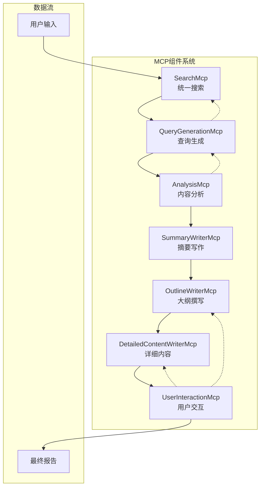

# MCP组件集成指南

## 概述

基于你现有的六个agent，我们已经重新整合并创建了一个统一的MCP (Model Context Protocol) 组件系统。这个系统包含7个核心MCP组件，提供了标准化的并行搜索和报告生成能力。

## 🏗️ 系统架构



## 📋 MCP组件详细说明

### 1. SearchMcp (统一搜索系统)
**文件**: `collectors/search_mcp.py`

**功能**:
- 整合所有现有的搜索收集器功能
- 提供标准化的并行搜索接口
- 支持多种数据源：Web搜索、学术搜索、新闻搜索

**核心方法**:
```python
search_mcp = SearchMcp()
results = search_mcp.parallel_search(
    queries=["查询1", "查询2", "查询3"],
    max_results_per_query=5,
    days_back=30,
    max_workers=4
)
```

**特点**:
- ⚡ 内置线程池，自动并行执行
- 🔄 基于URL的智能去重机制
- 📊 统一的Document数据结构
- 🛡️ 自动降级和错误恢复

### 2. QueryGenerationMcp (查询生成系统)
**文件**: `collectors/query_generation_mcp.py`

**功能**:
- 基于上下文生成高效的搜索查询
- 支持多种策略：初始、迭代、针对性查询

**核心方法**:
```python
query_mcp = QueryGenerationMcp()
queries = query_mcp.generate_queries(
    topic="人工智能",
    strategy="initial",  # initial, iterative, targeted
    context="为综合报告收集信息"
)
```

**策略类型**:
- `initial`: 生成广泛的初始查询
- `iterative`: 基于已有信息生成补充查询
- `targeted`: 为特定章节生成针对性查询
- `academic`: 学术导向查询
- `news`: 新闻导向查询

### 3. AnalysisMcp (分析系统)
**文件**: `collectors/analysis_mcp.py`

**功能**:
- 对文本或数据进行结构化的LLM分析
- 支持质量评估、相关性分析、意图理解

**核心方法**:
```python
analysis_mcp = AnalysisMcp()

# 质量分析
quality = analysis_mcp.analyze_quality(data, topic)

# 相关性分析
relevance = analysis_mcp.analyze_relevance(content, topic)

# 缺口分析
gaps = analysis_mcp.analyze_gaps(topic, existing_data)
```

**分析类型**:
- **质量评估**: 5维度评估（相关性、可信度、完整性、时效性、总体）
- **相关性分析**: 评估内容与主题的匹配程度
- **意图分析**: 理解用户查询的深层需求
- **结构解析**: 将非结构化文本转为JSON
- **缺口分析**: 识别信息覆盖的不足

### 4. SummaryWriterMcp (摘要写作系统)
**文件**: `collectors/summary_writer_mcp.py`

**功能**:
- 将文档浓缩成简洁的摘要
- 支持多种格式和长度要求

**核心方法**:
```python
summary_mcp = SummaryWriterMcp()
summary = summary_mcp.write_summary(
    content_data=documents,
    length_constraint="200-300字",
    format="paragraph",  # paragraph, bullet_points, structured
    target_audience="通用"
)
```

**摘要格式**:
- `paragraph`: 段落式摘要
- `bullet_points`: 要点式摘要
- `structured`: 结构化摘要
- `executive`: 执行摘要
- `academic`: 学术摘要

### 5. OutlineWriterMcp (大纲撰写系统)
**文件**: `collectors/outline_writer_mcp.py`

**功能**:
- 创建逻辑清晰的结构化大纲
- 支持多种报告类型的标准范式

**核心方法**:
```python
outline_mcp = OutlineWriterMcp()
outline = outline_mcp.create_outline(
    topic="人工智能应用",
    report_type="academic",  # academic, business, technical
    user_requirements="重点关注教育领域"
)
```

**报告类型**:
- `academic_proposal`: 学术开题报告
- `business_report`: 商业分析报告
- `technical_report`: 技术报告
- `industry_analysis`: 行业分析报告
- `comprehensive`: 综合报告

### 6. DetailedContentWriterMcp (详细内容撰写系统)
**文件**: `collectors/detailed_content_writer_mcp.py`

**功能**:
- 报告内容撰写的主力
- 支持并行生成多个章节内容

**核心方法**:
```python
content_mcp = DetailedContentWriterMcp()
content = content_mcp.write_section_content(
    section_title="技术发展现状",
    content_data=reference_documents,
    overall_report_context="人工智能综合报告"
)
```

**写作风格**:
- `professional`: 专业商务风格
- `academic`: 学术研究风格
- `technical`: 技术文档风格
- `business`: 商业分析风格

### 7. UserInteractionMcp (用户交互系统)
**文件**: `collectors/user_interaction_mcp.py`

**功能**:
- 在关键决策点获取用户输入
- 支持多种交互类型和接口

**核心方法**:
```python
interaction_mcp = UserInteractionMcp(interface_type="cli")

# 用户选择
choice = interaction_mcp.get_user_choice(
    prompt="请选择操作:",
    options=["继续", "修改", "取消"]
)

# 用户确认
confirmed = interaction_mcp.get_confirmation("是否继续?")

# 内容审查
review = interaction_mcp.review_and_modify(content, "大纲")
```

**交互类型**:
- 选择题、文本输入、确认对话
- 评分、多选、内容审查
- 支持CLI、Web、API三种接口模式

## 🚀 完整集成使用示例

### 基础使用
```python
from collectors.search_mcp import SearchMcp
from collectors.query_generation_mcp import QueryGenerationMcp

# 1. 生成查询
query_mcp = QueryGenerationMcp()
queries = query_mcp.generate_queries(
    topic="生成式AI",
    strategy="initial"
)

# 2. 执行搜索
search_mcp = SearchMcp()
results = search_mcp.parallel_search(queries)

# 3. 分析结果
analysis_mcp = AnalysisMcp()
quality = analysis_mcp.analyze_quality(results, "生成式AI")
```

### 完整报告生成流程
```python
# 参考 test_mcp_integration.py 中的 IntegratedReportGenerator 类
generator = IntegratedReportGenerator()
report_path = generator.generate_comprehensive_report(
    topic="人工智能发展趋势",
    report_type="comprehensive"
)
```

## 📁 项目文件结构

```
collectors/
├── search_mcp.py                    # 统一搜索系统
├── query_generation_mcp.py          # 查询生成系统
├── analysis_mcp.py                  # 分析系统
├── summary_writer_mcp.py            # 摘要写作系统
├── outline_writer_mcp.py            # 大纲撰写系统
├── detailed_content_writer_mcp.py   # 详细内容撰写系统
└── user_interaction_mcp.py          # 用户交互系统

# 测试和演示文件
test_mcp_integration.py              # 完整集成测试
test_search_mcp.py                   # SearchMcp测试

# 集成指南
SEARCH_MCP_INTEGRATION_GUIDE.md      # SearchMcp集成指南
MCP_INTEGRATION_GUIDE.md             # 完整MCP集成指南
```

## 🔧 集成到现有Agent

### 1. 替换现有收集器
```python
# 旧方式 - 使用多个独立收集器
# from collectors.tavily_collector import TavilyCollector
# from collectors.brave_search_collector import BraveSearchCollector
# tavily = TavilyCollector()
# brave = BraveSearchCollector()

# 新方式 - 使用统一SearchMcp
from collectors.search_mcp import SearchMcp
search_mcp = SearchMcp()
```

### 2. 标准化数据流
```python
# 统一的数据处理流程
def generate_report(topic: str):
    # 查询生成
    queries = query_mcp.generate_queries(topic, "initial")
    
    # 数据搜索
    data = search_mcp.parallel_search(queries)
    
    # 质量分析
    quality = analysis_mcp.analyze_quality(data, topic)
    
    # 大纲创建
    outline = outline_mcp.create_outline(topic, "comprehensive")
    
    # 内容生成
    content = content_mcp.write_multiple_sections(...)
    
    return assembled_report
```

### 3. 添加用户交互
```python
# 在关键决策点添加用户交互
if interaction_mcp:
    user_choice = interaction_mcp.get_user_choice(
        "数据质量较低，是否继续?",
        options=["继续", "重新搜索", "取消"]
    )
    
    if user_choice == "重新搜索":
        # 执行重新搜索逻辑
        pass
```

## 🧪 测试和验证

### 运行基础测试
```bash
# 测试独立组件功能
python test_mcp_integration.py

# 测试完整交互式流程
python test_mcp_integration.py --interactive
```

### 验证SearchMcp功能
```bash
python test_search_mcp.py
```

## 🔮 扩展和自定义

### 添加新的搜索源
```python
# 在SearchMcp中添加新的收集器
class SearchMcp:
    def __init__(self):
        # 添加新的收集器
        self.new_collector = NewCollector()
        
    def _get_available_collectors(self):
        collectors["new_source"] = self.new_collector
        return collectors
```

### 自定义分析模板
```python
# 在AnalysisMcp中添加新的分析模板
def _load_analysis_templates(self):
    templates = {
        # 现有模板...
        "custom_analysis": """
        自定义分析模板...
        """
    }
    return templates
```

### 扩展写作风格
```python
# 在DetailedContentWriterMcp中添加新的写作模板
def _load_writing_templates(self):
    return {
        # 现有模板...
        "creative": """
        创意写作模板...
        """
    }
```

## 🚀 部署建议

### 1. 环境配置
```bash
# 安装依赖
pip install -r requirements.txt

# 配置环境变量
cp .env.example .env
# 编辑 .env 文件，添加API密钥
```

### 2. 生产环境优化
- 启用数据库缓存
- 配置负载均衡
- 实施错误监控
- 设置日志记录

### 3. 性能调优
- 调整并行工作线程数
- 优化LLM调用频率
- 实施结果缓存
- 配置超时参数

## 📚 最佳实践

### 1. 错误处理
```python
try:
    results = search_mcp.parallel_search(queries)
except Exception as e:
    logger.error(f"搜索失败: {e}")
    # 使用备用方案
    results = fallback_search(queries)
```

### 2. 资源管理
```python
# 控制并发数量
search_mcp = SearchMcp(max_workers=4)

# 设置合理的超时
results = search_mcp.parallel_search(
    queries, 
    timeout_per_query=30
)
```

### 3. 质量控制
```python
# 分析数据质量
quality = analysis_mcp.analyze_quality(data, topic)
if quality.score < 0.7:
    # 生成补充查询
    additional_queries = query_mcp.generate_queries(
        topic, "iterative", context=f"质量不足: {quality.reasoning}"
    )
```

## 🎯 总结

这个MCP组件系统提供了：

✅ **统一接口**: 所有搜索和生成功能的标准化API  
✅ **并行处理**: 内置多线程和异步处理能力  
✅ **智能分析**: LLM驱动的质量分析和缺口识别  
✅ **灵活配置**: 支持多种报告类型和写作风格  
✅ **用户交互**: 完整的交互式决策支持  
✅ **易于扩展**: 模块化设计，便于添加新功能  
✅ **容错机制**: 完善的错误处理和降级方案  

通过这个集成系统，你可以：
- 📈 提高搜索效率和数据质量
- 🔄 实现标准化的报告生成流程  
- 🎯 支持多种报告类型和场景
- 👥 提供完整的用户交互体验
- 🚀 轻松扩展和自定义功能

开始使用：
```bash
python test_mcp_integration.py --interactive
``` 