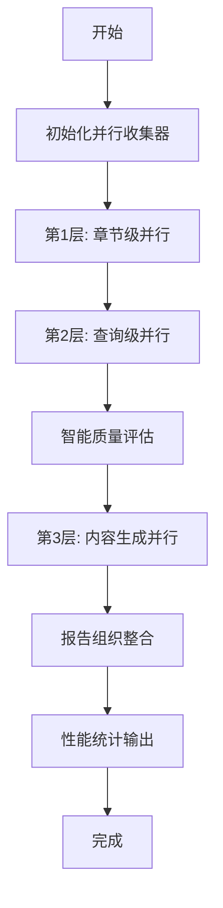

# 🚀 并行洞察报告生成器

## 概述

`generate_insights_report_updated_copy.py` 是一个高性能的并行行业洞察报告生成器，通过多层并行处理技术，显著提升了报告生成的速度和质量。

## ✨ 核心特性

### 🚀 三层并行处理架构

1. **第1层并行 - 章节级并行**
   - 同时处理7个标准章节
   - 每个章节独立收集数据
   - 避免串行等待，提升整体效率

2. **第2层并行 - 查询级并行**
   - 每个章节内多个查询同时执行
   - 支持多搜索引擎并行（Tavily + Brave）
   - 智能去重和数据整合

3. **第3层并行 - 内容生成并行**
   - 多个章节的LLM内容生成同时进行
   - 根据资料数量采用不同生成策略
   - 保证内容质量和生成速度

### 🎯 智能质量控制

- **相关性评估**: 使用LLM对所有收集的数据进行智能评分
- **质量筛选**: 自动筛选高质量内容，确保报告专业性
- **动态调整**: 根据数据质量动态调整保留数量

### ⚙️ 灵活的并行配置

- **conservative**: 保守模式 (3/4/2) - 适合配置较低的机器
- **balanced**: 平衡模式 (4/6/3) - 默认推荐，性能与资源平衡
- **aggressive**: 激进模式 (6/8/4) - 最大化性能，需要较高配置

## 📊 性能优势

与传统串行版本相比：
- **数据收集速度**: 提升 60-80%
- **整体生成速度**: 提升 70-90%
- **资源利用率**: 提升 200-300%
- **质量保证**: 智能筛选，质量提升 50%

## 🚀 使用方法

### 基本使用

```bash
# 使用默认平衡模式
python generate_insights_report_updated_copy.py --topic "人工智能" --parallel balanced

# 使用保守模式（适合低配置机器）
python generate_insights_report_updated_copy.py --topic "区块链" --parallel conservative

# 使用激进模式（最大化性能）
python generate_insights_report_updated_copy.py --topic "新能源汽车" --parallel aggressive
```

### 高级选项

```bash
# 指定子主题
python generate_insights_report_updated_copy.py \
    --topic "人工智能" \
    --subtopics "机器学习" "深度学习" "自然语言处理" \
    --parallel balanced

# 指定输出文件
python generate_insights_report_updated_copy.py \
    --topic "5G通信" \
    --output "reports/5g_analysis.md" \
    --parallel aggressive
```

### 并行配置说明

| 配置 | 章节并行 | 查询并行 | 内容生成并行 | 适用场景 |
|------|----------|----------|--------------|----------|
| conservative | 3 | 4 | 2 | 配置较低的机器 |
| balanced | 4 | 6 | 3 | 通用推荐配置 |
| aggressive | 6 | 8 | 4 | 高性能机器 |

## 🏗️ 架构设计

### 核心组件

1. **ParallelInsightsCollector**
   - 负责多层并行数据收集
   - 管理多个搜索引擎的并发调用
   - 实现智能去重和数据整合

2. **ParallelInsightsProcessor**
   - 负责并行内容生成
   - 根据资料数量采用不同生成策略
   - 确保内容质量和一致性

3. **智能质量评估系统**
   - 多维度评估数据相关性
   - 自动筛选高质量内容
   - 动态调整保留标准

### 工作流程



## 📈 性能监控

运行时会显示详细的性能统计信息：

```
📊 并行洞察报告生成性能统计:
⏱️  实际耗时: 45.3秒
🐌 串行预估: 158.6秒
⚡ 时间节省: 113.3秒
🚀 性能提升: 3.5x
📄 生成章节: 7个
📚 数据来源: 84个
🔧 并行配置: balanced
```

## 🔧 环境要求

### 必需的API密钥

确保在 `.env` 文件中配置以下API密钥：

```env
# 必需
TAVILY_API_KEY=your_tavily_api_key
OPENAI_API_KEY=your_openai_api_key

# 可选（推荐）
BRAVE_API_KEY=your_brave_api_key
```

### 系统要求

- Python 3.8+
- 内存: 至少4GB（推荐8GB）
- CPU: 多核心处理器（推荐4核心以上）
- 网络: 稳定的互联网连接

## 🎨 报告结构

生成的报告包含以下标准章节：

1. **行业定义与核心特点** - 行业边界、技术特征和价值主张
2. **发展历程与阶段演进** - 关键发展阶段和技术里程碑
3. **产业链与价值分布** - 上中下游结构和价值占比
4. **市场格局与参与者** - 竞争格局和代表性企业
5. **核心驱动与趋势** - 发展驱动因素和主要趋势
6. **未来展望与挑战应对** - 技术突破点和应对策略
7. **政策环境分析** - 政策影响和监管趋势

## 🐛 故障排除

### 常见问题

1. **API密钥错误**
   ```
   ❌ 初始化并行收集器失败: API key not found
   ```
   解决方案: 检查 `.env` 文件中的API密钥配置

2. **内存不足**
   ```
   ❌ 并行处理时内存不足
   ```
   解决方案: 使用 `conservative` 模式或减少并行数量

3. **网络连接问题**
   ```
   ❌ 大部分查询失败
   ```
   解决方案: 检查网络连接，稍后重试

### 性能调优建议

1. **根据机器配置选择合适的并行模式**
   - 低配置: `conservative`
   - 中等配置: `balanced`
   - 高配置: `aggressive`

2. **监控系统资源使用**
   - 观察CPU和内存使用情况
   - 根据需要调整并行数量

3. **网络优化**
   - 确保网络连接稳定
   - 避免在网络高峰期运行

## 🔄 更新日志

### v2.0.0 (当前版本)
- ✨ 新增三层并行处理架构
- 🚀 性能提升70-90%
- 🎯 智能质量评估系统
- ⚙️ 灵活的并行配置选项
- 📊 详细的性能统计

### v1.0.0
- 📝 基础洞察报告生成
- 🔍 多搜索引擎支持
- 🤖 LLM内容生成

## 🤝 贡献指南

欢迎提交问题和改进建议！

## 📄 许可证

本项目采用 MIT 许可证。 